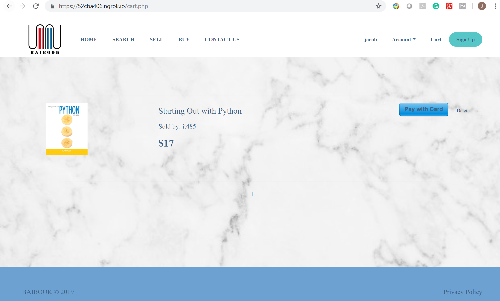
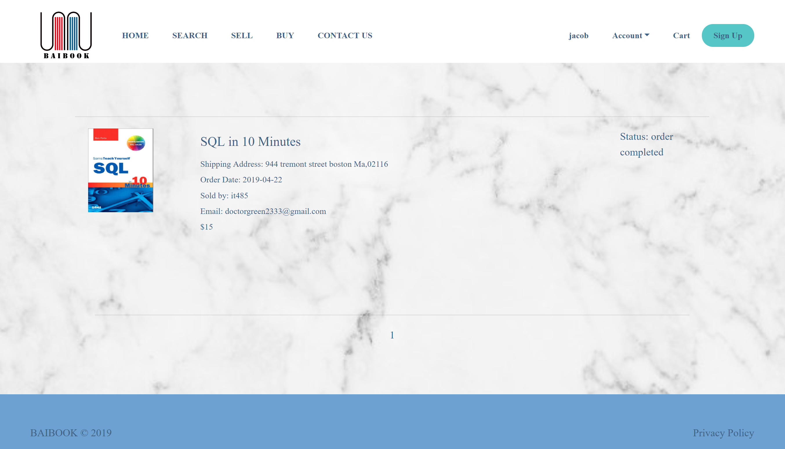

</h2># Used-book-selling-website</h2>  
Website function includes:   
1.logging system  
2.Register account  
3.login and log out  
4.Profile editing  
5.Forget password  
6.Create a selling order  
7.Managed selling orders  
8.Create a buying order 
9.Buying Searching item  
10.Contact sellers  
11.Add item to cart  
12.Create a payment  
13.Manager your buying order 
Payment process base on a agent Stripe account 
Mailing process base on a agent gmail account 

-------------------------------------------------------------------------------------------
All styling files,API connection file, PHPmailer connection file. is in the "tools.zip" file. 
Stripe KEY pair need to be setup. 
PHPmailer require your email address and password for a agent email. 
4 database tables is not inculde. 

--------------------------------------------------------------------------------------------
output-xx.png fils is the website look like

<h2>Home page:</h2>

<h2>Sign up page:</h2>

<h2>Login page:</h2>

<h2>Buying page:</h2>

<h2>Search page:</h2>

<h2>Shopping cart page:</h2>

<h2>Order history page:</h2>

<h2>Selling page:</h2>

<h2>Selling order review:</h2>

